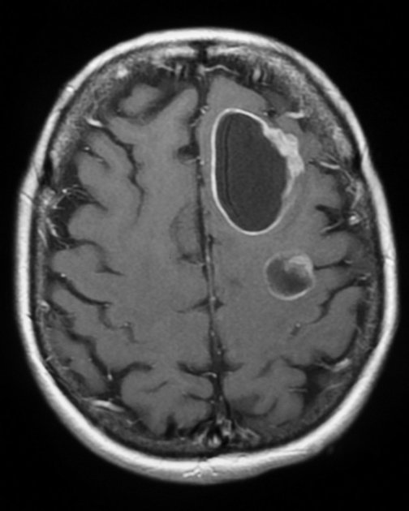

# Brain Metastases Detection GUI

A lightweight Python-based Graphical User Interface (GUI) designed to assist in the detection and visualization of brain metastases from MRI scans. This application serves as a frontend interface for a deep learning detection system (based on YOLOv7).

## 🧠 Project Overview

This tool provides a user-friendly environment for medical professionals or researchers to:
- Load MRI images.
- Visualize detection results.
- Analyze potential metastatic regions.

> **Note:** This repository contains the source code for the application logic and UI. The heavy model weights (`best.pt`) and the core YOLOv7 library are excluded to keep the repository lightweight. You may need to add them locally to `src/weight/` and `src/yolov7-main/` respectively to run the full inference.

## 📸 Sample Images

Here are some examples of MRI scans used in this project:

### 1. Brain Metastasis Example


### 2. General MRI Scan


### 3. Non-Metastasis Example


## 🚀 Usage

1.  **Dependencies**: Ensure you have the required Python packages (see `requirements.txt`).
2.  **Run Application**:
    ```bash
    python src/main.py
    ```

## 📂 Project Structure

- `src/main.py`: Entry point of the application.
- `src/ui/`: Contains the User Interface code (`window.py`, `styles.py`, `viewer.py`).
- `src/backend/`: Handling detection logic (`detector.py`).
